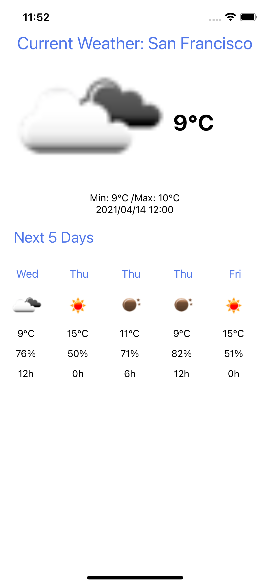

# forecast-weather
## About

 The application shows the forecast for the next 5 days. Also showed current forecast for one day.
 App cheked for iOS only.

## Install Dependencies

To run the app, simply clone the repo. Follow these instructions if you need to start project https://reactnative.dev/docs/environment-setup  



```bash
yarn install
```
## Start Application 

```bash
npx react-native run-ios
```
